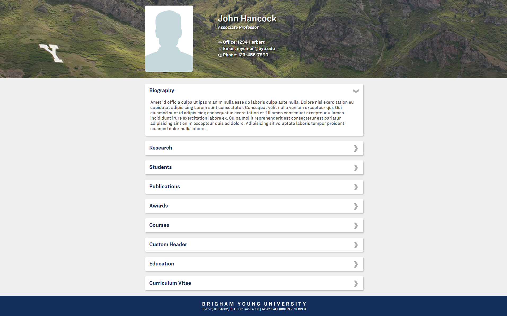

# byu-faculty-directory

This is a simple Web Component using the BYU Web Community web component tools. It is meant to be used to display a directory listing for a faculty member.

## How to Use

Drupal - coming soon (see https://github.com/byuweb/faculty_directory_d8 )

Other - 

Reference the js and css files for the component via the CDN:
js: https://cdn.byu.edu/byu-faculty-directory/1.x.x/byu-faculty-directory.min.js
css: https://cdn.byu.edu/byu-faculty-directory/1.x.x/byu-faculty-directory.min.css

Then, place your content inside <byu-faculty-listing> tags. See the demo for more info (clone repo, open demo.html)

## How it Works

### BYU Faculty Listing

```html
<byu-faculty-listing id="id" faculty-image="img_src" faculty-profile-link="link_src">
	<h2 slot="listing-name">Name</h2>
	<span slot="listing-title">Title</span>
	<span slot="listing-office">Office Location</span>
	<span slot="listing-phone">Phone Number</span>
	<span slot="listing-email">Email Address</span>
	<span slot="listing-office-hours">Office Hours</span>
	<p slot="listing-research">Research</p>
	<p slot="listing-biography">Biography</p>
</byu-faculty-listing>
```

Each listing consists of three columns - one for a profile image, one for contact information, and one for research and biography. Clicking on the image or the title will take you to that faculty member's specific profile page.
Place the url to the profile image in a "faculty-image" attribute of the <byu-faculty-listing> tag.
Place the url to the faculty profile page in a "faculty-profile-link" attribute of the <byu-faculty-listing> tag.
The content should then be placed in an appropriate slot (see above).


### BYU Faculty Card
```html
<byu-faculty-card id="id" faculty-image="img_src" faculty-profile-link="link_src">
	<h2 slot="listing-name">Name</h2>
	<span slot="listing-title">Title</span>
	<span slot="listing-office">Office Location</span>
	<span slot="listing-phone">Phone Number</span>
	<span slot="listing-email">Email Address</span>
</byu-faculty-card>
```
The card works just like the listing; however, it is excludes some of the content to make the card much smaller. The card is ideal if you want to display 3 or 4 listings one line.


### BYU Faculty Profile

```html
  <byu-faculty-profile background-image="./test_image_5.jpg" faculty-image="./test_image.png">
    <div slot="faculty-name">Name</div>
    <span slot="faculty-title">Title</span>
    <span slot="faculty-office">Office Location</span>
    <span slot="faculty-phone">Phone Number</span>
    <span slot="faculty-email">Email Address</span>
    <p slot="faculty-biography">Place biography information here</p>
    <p slot="faculty-research">Place research information here</p>
    <p slot="faculty-papers">Place papers information here</p>
    <p slot="faculty-students">Place student information here</p>
    <p slot="faculty-awards">Place awards information here</p>
    <div slot="faculty-custom-header">Custom Header</div>
    <p slot="faculty-custom-body">Place custom body information here</p>
    <p slot="faculty-education">Place education information here!</p>
    <p slot="faculty-cv">Place CV File here</p>
  </byu-faculty-profile>
```

The faculty profile is best used as the destination link when clicking on a listing from above. It adds a few more slots that you are able to put more information into it.
It also lets you choose a background-image. Just put the link to the image and it will be seen in the profile.



## Tips
-If you don't need/want to fill all the slots, no worries. Just leave them out and they will automatically remove themselves from the component. 
-To center the cards, just put a div around the entire card area, and style that div to text-align: center;

 
# Getting Started

```
npm install
```

To run a local development server with a file watch, run

```
npm start
```

To assemble the final distribution bundle, run

```
npm run build
```

To run automatic unit tests, run

```
npm test
```